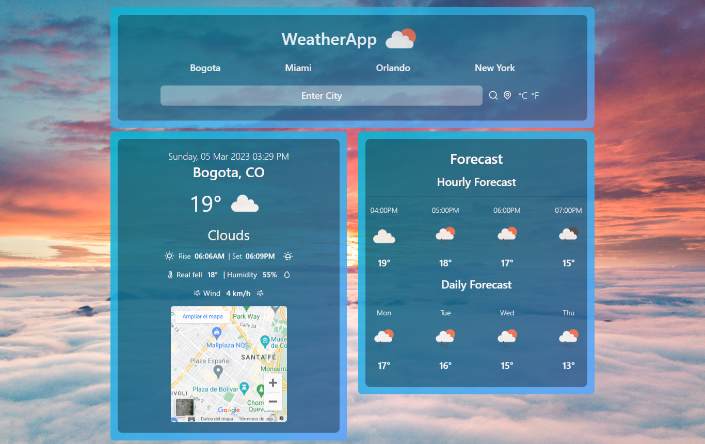

# WeatherApp



[React WeatherApp](https://jgd-weather.vercel.app/) is a beautiful application that queries the weather with the API of [OpenWeatherMap API](https://openweathermap.org/api).

Check the weather in your city (you must give permissions to access your location).

Check the weather of some major cities.

Check the weather of any city through the search.

## Technologies

-   React JS
-   Vite
-   Tailwind CSS
-   Bootstrap
-   React-Bootstrap
-   React Unicons
-   SweetAlert2
-   Luxon

## Getting started

-   Sign up over at [openweathermap.org](https://openweathermap.org) and get an API key.
-   Fork the project and clone it locally.
-   Install dependencies using [Node.js and npm](https://docs.npmjs.com/downloading-and-installing-node-js-and-npm):

## Useful Commands

Install Dependencies

```
npm install
```

Run dev server

```
npm start
```

Build App

```
npm run build
```
